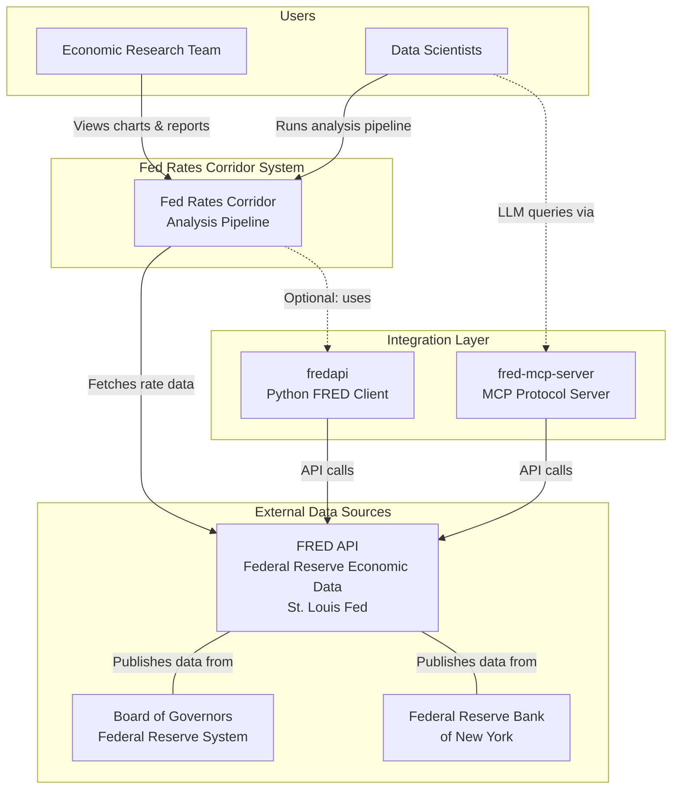
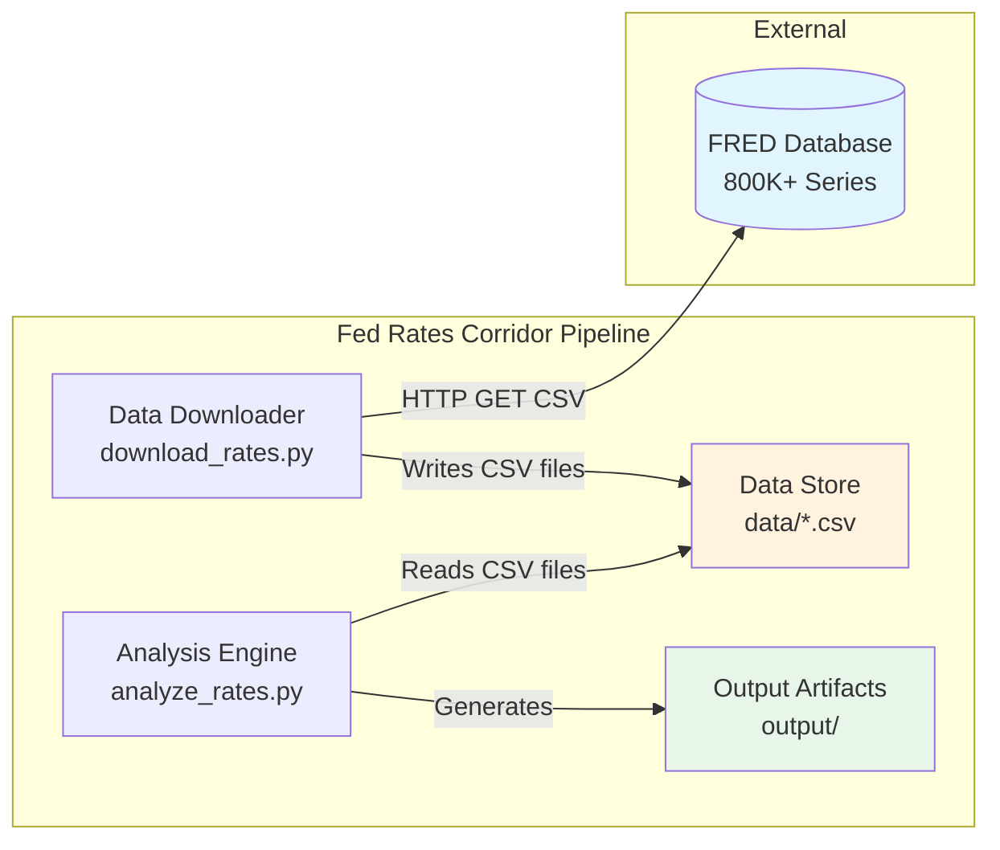
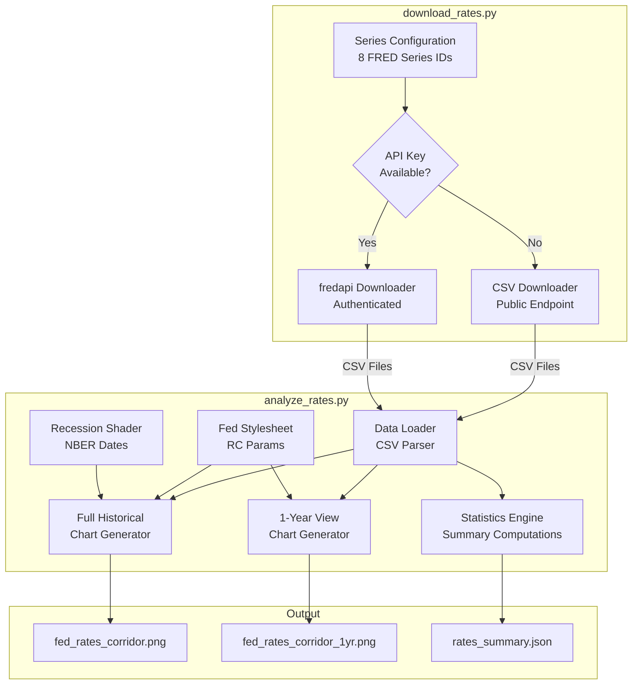
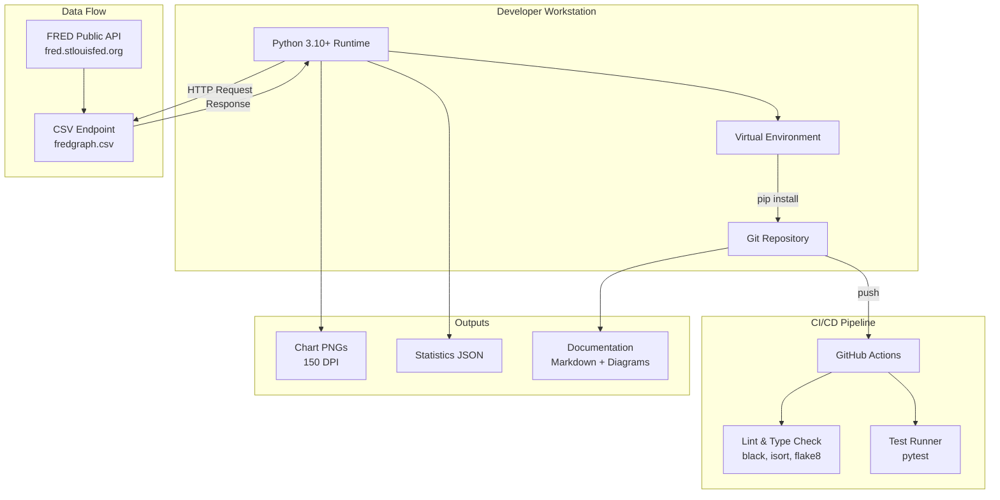
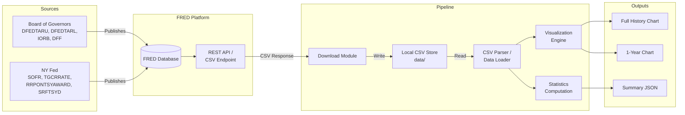
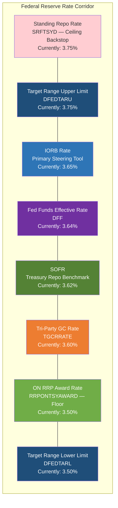

# Architecture Diagrams

## System Context (C4 Level 1)

## Container Diagram (C4 Level 2)

## Component Diagram (C4 Level 3)

## Deployment Diagram

## Data Flow Diagram

## Rate Corridor Conceptual Model

