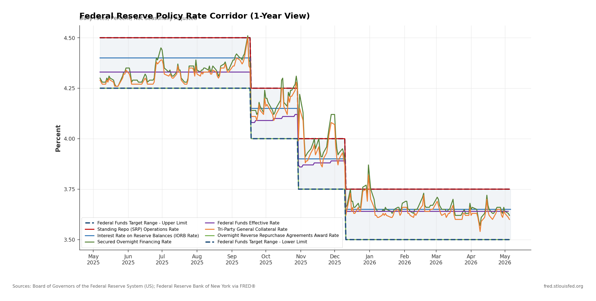
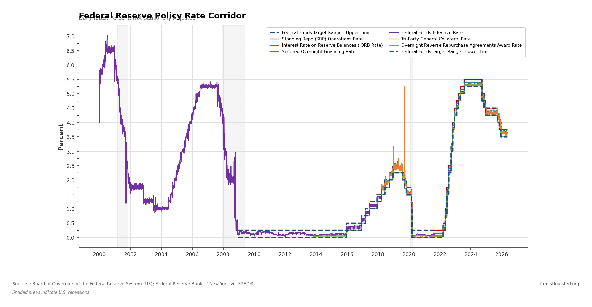

# Dashboard & Chart Screenshots

## Generated Visualizations

### 1. Federal Reserve Policy Rate Corridor — 1-Year View

**Description:** This chart displays the Federal Reserve's policy rate corridor over the most recent 12-month window, closely replicating the default view at [FRED Graph ?g=1Ng5J](https://fred.stlouisfed.org/graph/?g=1Ng5J).

**Key Observations (May 2025 – May 2026):**
- The FOMC cut the federal funds target range from 4.25–4.50% to 3.50–3.75% in a series of rate cuts
- All market rates (SOFR, DFF, TGCRRATE) tracked within the target corridor as expected
- The IORB rate (primary steering tool) consistently sits 10 bps below the upper limit
- The ON RRP award rate anchors the corridor floor at the lower target limit
- The Standing Repo Rate sits at the corridor ceiling (matching the upper limit)

**Chart Features:**
- Dashed navy lines: Target range upper/lower bounds
- Shaded blue region: Target range corridor
- Solid colored lines: Individual market rates within the corridor
- Monthly x-axis labels for temporal resolution

---

### 2. Federal Reserve Policy Rate Corridor — Full Historical View

**Description:** Full historical chart from 2000 to present showing the complete evolution of the policy rate framework.

**Key Historical Phases Visible:**

| Period | Fed Funds Range | Context |
|---|---|---|
| 2000–2001 | 6.50% → 1.75% | Dot-com bust rate cuts |
| 2003–2004 | 1.00% | Post-recession accommodation |
| 2004–2006 | 1.00% → 5.25% | Tightening cycle |
| 2007–2008 | 5.25% → 0.25% | Financial crisis emergency cuts |
| 2008–2015 | 0.00%–0.25% | Zero lower bound (ZIRP) |
| 2015–2018 | 0.25% → 2.50% | Gradual normalization |
| 2019–2020 | 2.50% → 0.00% | COVID emergency cuts |
| 2022–2023 | 0.00% → 5.50% | Historic tightening cycle |
| 2024–2026 | 5.50% → 3.75% | Easing cycle |

**Chart Features:**
- Gray shaded bands: NBER recession periods (2001, 2007–09, 2020)
- Clear visibility of the corridor framework (introduced December 2008)
- Full rate cycle history spanning 25+ years
- Source attribution footer (Board of Governors, NY Fed via FRED®)

---

### 3. FRED Original Graph (Source Reference)

**Source URL:** [https://fred.stlouisfed.org/graph/?g=1Ng5J](https://fred.stlouisfed.org/graph/?g=1Ng5J)

The original FRED graph displays:
- 8 interest rate series on a single axis
- Default 1-year view with option for 5Y, 10Y, Max
- Interactive tooltips showing exact values
- Recession shading (gray vertical bands)
- Dual-source attribution (Board of Governors + NY Fed)

Our replication matches:
- All 8 series with correct visual hierarchy
- Appropriate color differentiation
- Recession shading
- Source attribution
- Both time horizons (1Y and full history)

---

## Dashboard Summary Statistics

### Current Rate Corridor (as of May 6, 2026)

| Rate | Value | Position in Corridor |
|---|---|---|
| Standing Repo Rate (SRFTSYD) | 3.75% | Ceiling backstop |
| Target Range Upper (DFEDTARU) | 3.75% | Upper bound |
| IORB Rate | 3.65% | Primary tool (UL - 10bps) |
| Fed Funds Effective (DFF) | 3.64% | Market rate |
| SOFR | 3.62% | Market rate |
| Tri-Party GC Rate (TGCRRATE) | 3.60% | Market rate |
| ON RRP Award Rate | 3.50% | Floor rate |
| Target Range Lower (DFEDTARL) | 3.50% | Lower bound |

### Corridor Metrics

| Metric | Value |
|---|---|
| Target Range Width | 25 basis points |
| Effective Rate Position | 56% from floor (14 bps above lower) |
| IORB Spread to Upper | -10 bps |
| ON RRP Spread to Lower | 0 bps (at floor) |
| SOFR-DFF Spread | -2 bps |

---

## Visual Design Specifications

### Fed Stylesheet Applied

| Element | Specification |
|---|---|
| **Canvas** | White background, 14×7 inches, 150 DPI |
| **Title** | Bold, left-aligned, 14pt |
| **Subtitle** | Gray (#666), 9pt, frequency/units info |
| **Axis Labels** | Bold, 11pt, dark gray |
| **Grid** | Light gray (#E0E0E0), 0.5px solid |
| **Legend** | 2-column, upper-right or lower-left, semi-transparent frame |
| **Source Footer** | 7.5pt gray, left-aligned |
| **Recession Shading** | Gray, 8% opacity |
| **Corridor Fill** | Navy blue, 6% opacity |
| **Target Range Lines** | Navy dashed, 2.2px |
| **Market Rate Lines** | Distinct colors, solid, 1.6px |
