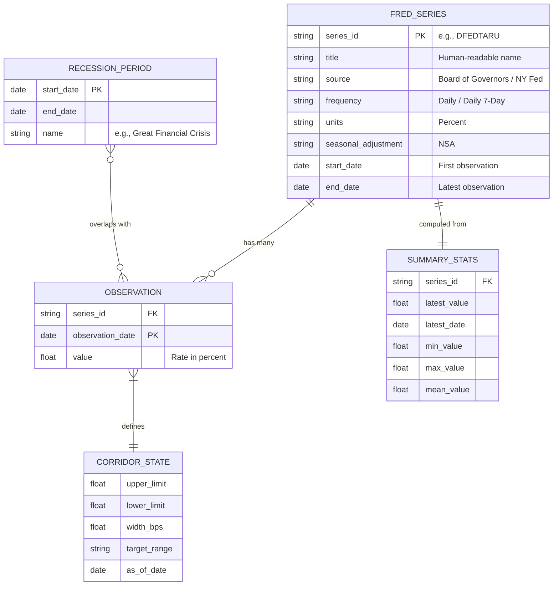

# Data Models

## Overview

This document describes the data models used in the Federal Reserve Policy Rate Corridor analysis pipeline, including input schemas, internal representations, and output formats.

---

## Input Data Models

### FRED CSV Schema (Public Endpoint)

Each downloaded CSV file follows this schema:

```
┌──────────────────────┬────────────────┐
│ observation_date     │ {SERIES_ID}    │
├──────────────────────┼────────────────┤
│ YYYY-MM-DD (string)  │ float / "."    │
│ 2024-01-02           │ 5.33           │
│ 2024-01-03           │ 5.33           │
│ ...                  │ ...            │
└──────────────────────┴────────────────┘
```

| Field | Type | Description |
|---|---|---|
| `observation_date` | String (YYYY-MM-DD) | Date of observation |
| `{SERIES_ID}` | Float or "." | Rate value in percent; "." indicates missing |

### FRED API Response Schema (fredapi)

When using the `fredapi` library, data is returned as:

```python
pandas.Series(
    index=DatetimeIndex,  # Observation dates
    data=float64,         # Rate values (NaN for missing)
    name=str              # Series ID
)
```

---

## Internal Data Models

### Series Configuration

```python
SERIES: dict[str, str] = {
    "DFEDTARU": "Federal Funds Target Range - Upper Limit",
    "DFEDTARL": "Federal Funds Target Range - Lower Limit",
    "IORB":     "Interest Rate on Reserve Balances (IORB Rate)",
    "SOFR":     "Secured Overnight Financing Rate",
    "DFF":      "Federal Funds Effective Rate",
    "TGCRRATE": "Tri-Party General Collateral Rate",
    "RRPONTSYAWARD": "Overnight Reverse Repurchase Agreements Award Rate",
    "SRFTSYD":  "Standing Repo (SRP) Operations Rate",
}
```

### Loaded DataFrame Model

After `load_series()` processes a CSV file:

```
┌─────────────────────────────────────┐
│ DataFrame                           │
├─────────────────────────────────────┤
│ Index: DatetimeIndex ("date")       │
│   dtype: datetime64[ns]             │
│   freq: None (irregular daily)      │
│                                     │
│ Columns:                            │
│   value: float64                    │
│     - Interest rate in percent      │
│     - NaN values dropped            │
│     - Range: 0.00 to ~7.00+        │
└─────────────────────────────────────┘
```

### Data Dictionary (All Loaded Series)

```python
data: dict[str, pd.DataFrame] = {
    "DFEDTARU": DataFrame,  # Upper target limit
    "DFEDTARL": DataFrame,  # Lower target limit
    "IORB":     DataFrame,  # Reserve balance rate
    "SOFR":     DataFrame,  # Secured overnight rate
    "DFF":      DataFrame,  # Effective fed funds
    "TGCRRATE": DataFrame,  # Tri-party GC rate
    "RRPONTSYAWARD": DataFrame,  # ON RRP rate
    "SRFTSYD":  DataFrame,  # Standing repo rate
}
```

---

## Chart Configuration Models

### Color Mapping

```python
FED_COLORS: dict[str, str] = {
    "DFEDTARU":      "#1f4e79",  # Navy blue
    "DFEDTARL":      "#1f4e79",  # Navy blue (same)
    "SRFTSYD":       "#c00000",  # Red
    "IORB":          "#2e75b6",  # Medium blue
    "SOFR":          "#548235",  # Forest green
    "DFF":           "#7030a0",  # Purple
    "TGCRRATE":      "#ed7d31",  # Orange
    "RRPONTSYAWARD": "#70ad47",  # Light green
}
```

### Plot Order (Vertical Positioning)

```python
PLOT_ORDER: list[str] = [
    "DFEDTARU",       # Corridor ceiling
    "SRFTSYD",        # Standing Repo (at ceiling)
    "IORB",           # Primary steering rate
    "SOFR",           # Market rate (within corridor)
    "DFF",            # Market rate (within corridor)
    "TGCRRATE",       # Market rate (within corridor)
    "RRPONTSYAWARD",  # Floor rate
    "DFEDTARL",       # Corridor floor
]
```

### Recession Periods Model

```python
RECESSIONS: list[tuple[str, str]] = [
    ("2001-03-01", "2001-11-01"),   # Dot-com bust
    ("2007-12-01", "2009-06-01"),   # Great Financial Crisis
    ("2020-02-01", "2020-04-01"),   # COVID-19
]
```

---

## Output Data Models

### Summary Statistics JSON Schema

```json
{
    "DFEDTARU": {
        "label": "Federal Funds Target Range - Upper Limit",
        "latest_value": 3.75,
        "latest_date": "2026-05-06",
        "min_value": 0.25,
        "max_value": 5.5,
        "mean_value": 1.8234
    },
    "DFEDTARL": {
        "label": "Federal Funds Target Range - Lower Limit",
        "latest_value": 3.50,
        "latest_date": "2026-05-06",
        "min_value": 0.0,
        "max_value": 5.25,
        "mean_value": 1.5734
    },
    "IORB": { ... },
    "SOFR": { ... },
    "DFF": { ... },
    "TGCRRATE": { ... },
    "RRPONTSYAWARD": { ... },
    "SRFTSYD": { ... },
    "corridor_width_bps": 25.0,
    "current_target_range": "3.50% - 3.75%"
}
```

### JSON Schema Definition

```json
{
    "$schema": "http://json-schema.org/draft-07/schema#",
    "title": "RateCorridorSummary",
    "type": "object",
    "properties": {
        "corridor_width_bps": {
            "type": "number",
            "description": "Width of target range in basis points"
        },
        "current_target_range": {
            "type": "string",
            "description": "Formatted target range string"
        }
    },
    "patternProperties": {
        "^[A-Z]+$": {
            "type": "object",
            "properties": {
                "label": { "type": "string" },
                "latest_value": { "type": "number" },
                "latest_date": { "type": "string", "format": "date" },
                "min_value": { "type": "number" },
                "max_value": { "type": "number" },
                "mean_value": { "type": "number" }
            },
            "required": ["label", "latest_value", "latest_date"]
        }
    }
}
```

---

## Entity Relationship Diagram



---

## Data Volume Estimates

| Series | Start | Records | CSV Size | Memory |
|---|---|---|---|---|
| DFF | 2000-01-03 | ~6,800 | ~154 KB | ~550 KB |
| DFEDTARU | 2008-12-16 | ~6,200 | ~102 KB | ~500 KB |
| DFEDTARL | 2008-12-16 | ~6,200 | ~102 KB | ~500 KB |
| IORB | 2021-07-29 | ~1,700 | ~28 KB | ~140 KB |
| SOFR | 2018-04-03 | ~2,000 | ~33 KB | ~160 KB |
| TGCRRATE | 2018-05-03 | ~1,900 | ~33 KB | ~155 KB |
| RRPONTSYAWARD | 2013-09-23 | ~3,200 | ~52 KB | ~260 KB |
| SRFTSYD | 2021-07-29 | ~1,200 | ~20 KB | ~100 KB |
| **Total** | | **~29,200** | **~524 KB** | **~2.4 MB** |

---

## Type Annotations

```python
from typing import TypedDict
from datetime import date


class SeriesStats(TypedDict):
    label: str
    latest_value: float
    latest_date: str  # ISO format YYYY-MM-DD
    min_value: float
    max_value: float
    mean_value: float


class CorridorSummary(TypedDict):
    corridor_width_bps: float
    current_target_range: str
    DFEDTARU: SeriesStats
    DFEDTARL: SeriesStats
    IORB: SeriesStats
    SOFR: SeriesStats
    DFF: SeriesStats
    TGCRRATE: SeriesStats
    RRPONTSYAWARD: SeriesStats
    SRFTSYD: SeriesStats
```
