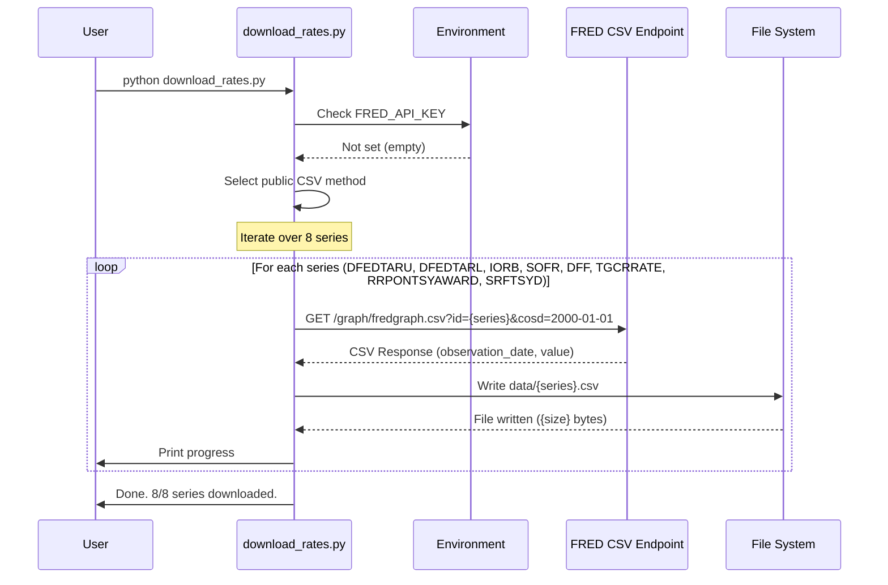
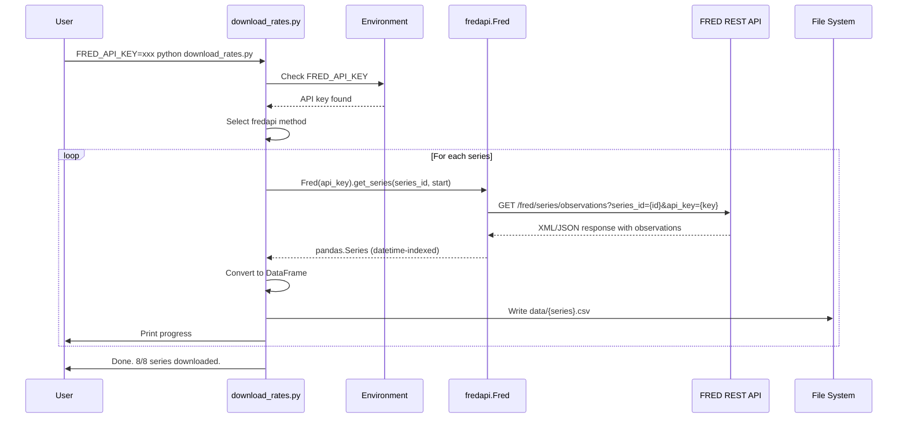
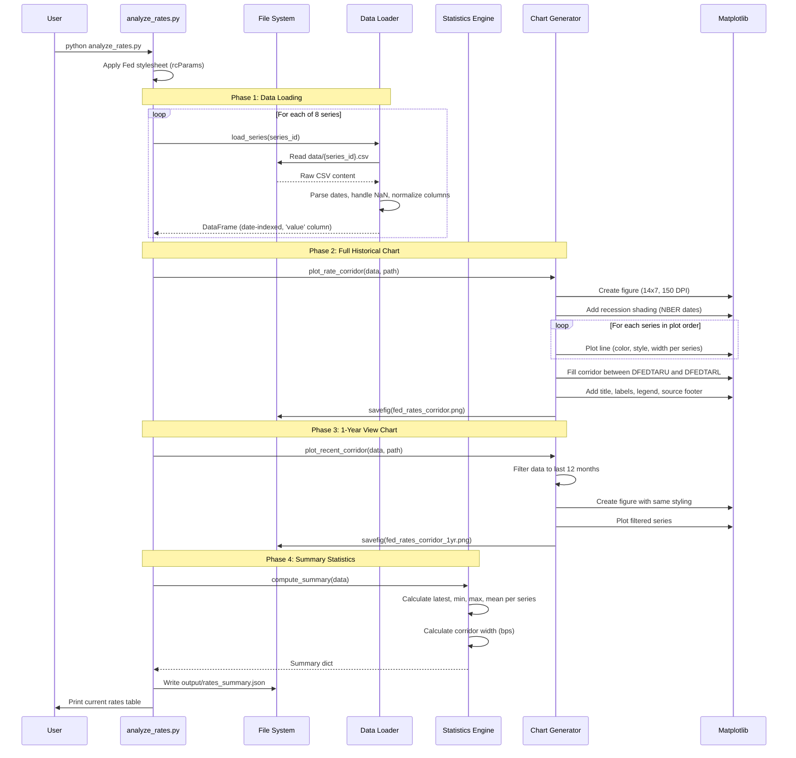
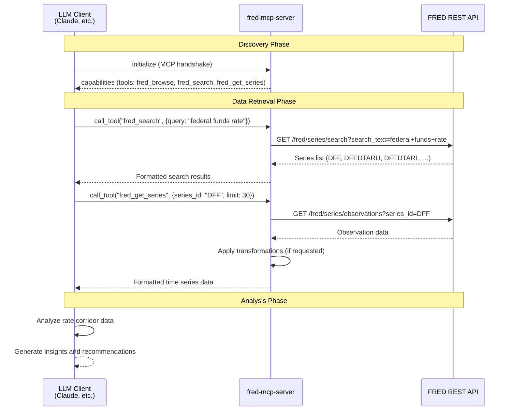
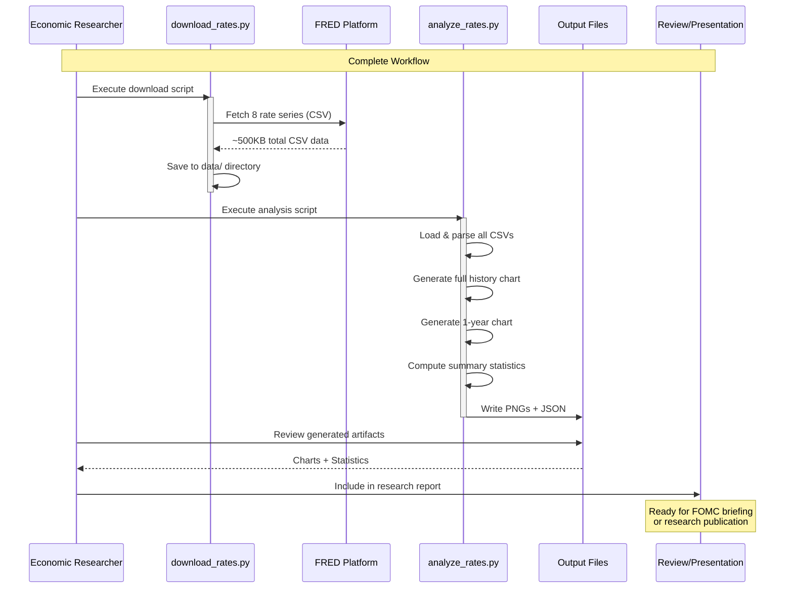
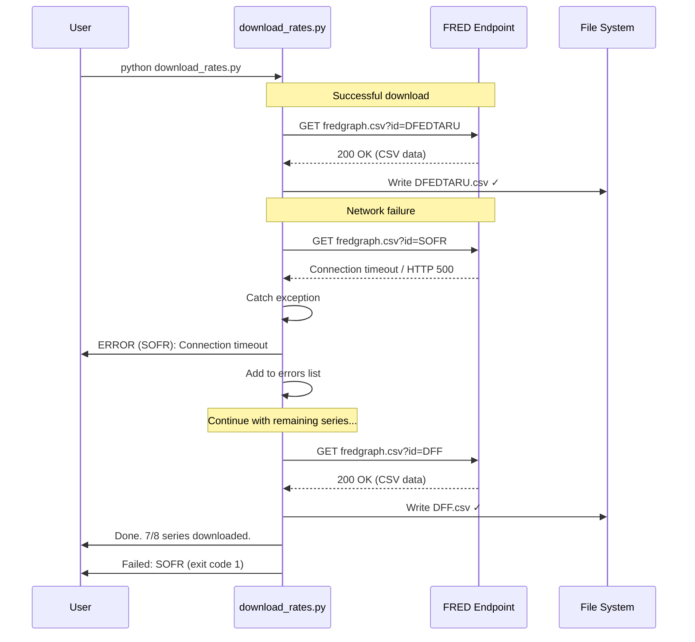

# Sequence Diagrams

## 1. Data Download Sequence (Public CSV Endpoint)

## 2. Data Download Sequence (fredapi Library)

## 3. Analysis & Chart Generation Sequence

## 4. MCP Integration Sequence (fred-mcp-server)

## 5. End-to-End Pipeline Sequence

## 6. Error Handling Sequence

