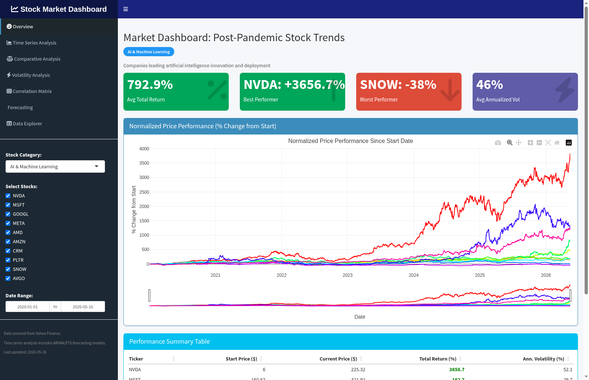
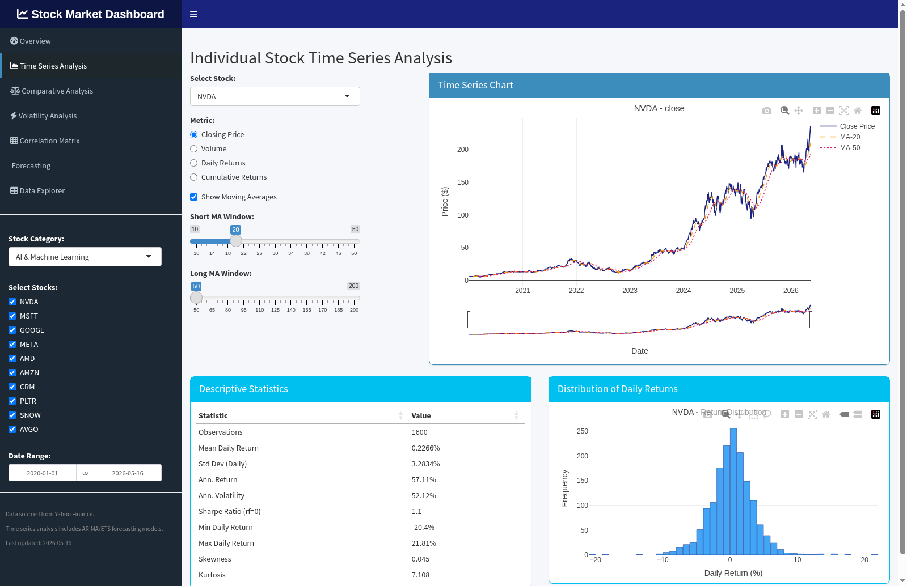
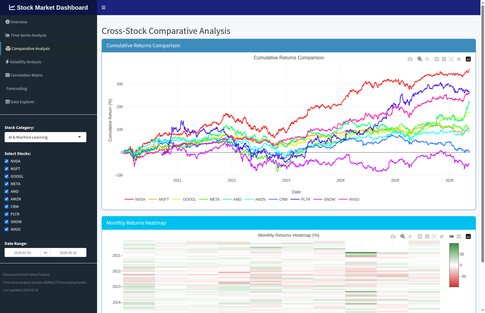
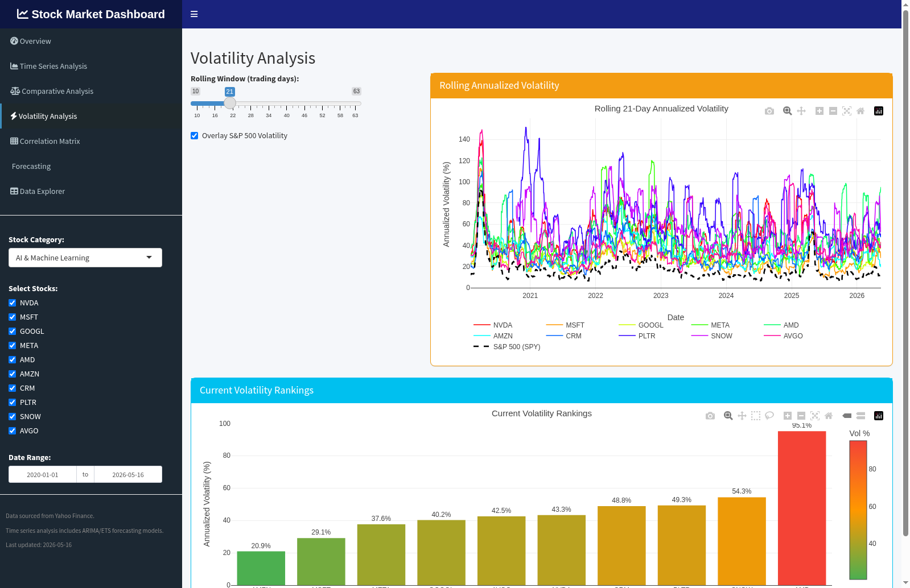
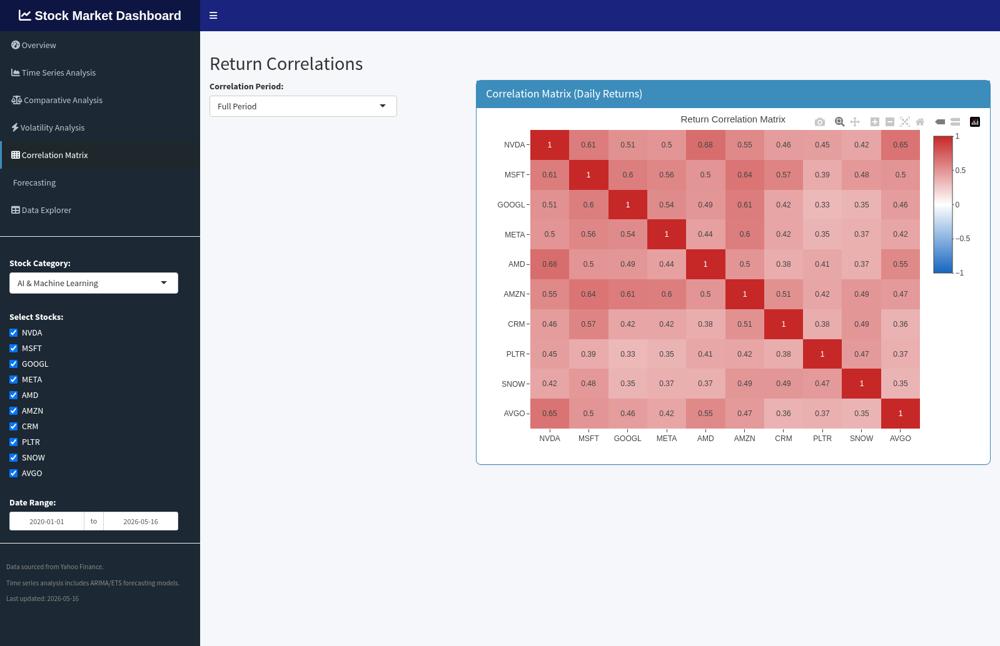
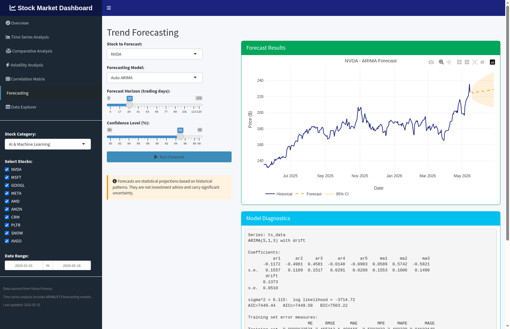
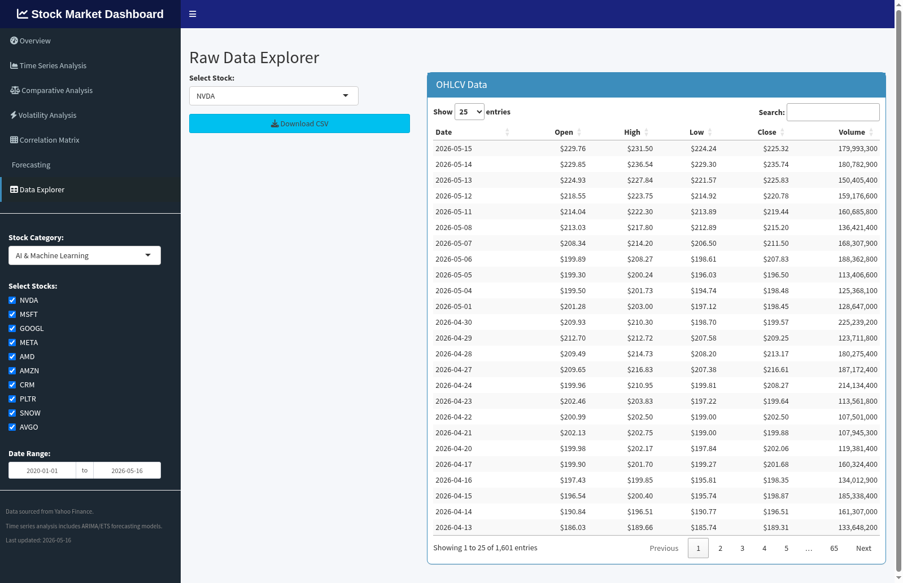

# User Guide

## Stock Market Dashboard - R Shiny Application

---

## Table of Contents

1. [Getting Started](#getting-started)
2. [Dashboard Overview](#dashboard-overview)
3. [Using the Sidebar Controls](#using-the-sidebar-controls)
4. [Tab Guide](#tab-guide)
   - [Overview](#overview-tab)
   - [Time Series Analysis](#time-series-analysis-tab)
   - [Comparative Analysis](#comparative-analysis-tab)
   - [Volatility Analysis](#volatility-analysis-tab)
   - [Correlation Matrix](#correlation-matrix-tab)
   - [Forecasting](#forecasting-tab)
   - [Data Explorer](#data-explorer-tab)
5. [Running Locally](#running-locally)
6. [Deploying to AWS](#deploying-to-aws)
7. [Troubleshooting](#troubleshooting)

---

## Getting Started

The Stock Market Dashboard is an interactive web application for analyzing stock market trends since the COVID-19 pandemic. It tracks 40 stocks across four thematic categories and provides time series analysis, comparisons, volatility metrics, correlations, and forecasting.

### Accessing the Dashboard

- **Local development**: Open `http://localhost:3838` in your browser after starting the application
- **AWS deployment**: Use the ALB URL provided by Terraform output (`terraform output alb_url`)

---

## Dashboard Overview

The dashboard is organized into a **sidebar** (left) and a **main content area** (right). The sidebar contains global controls that affect all tabs, while the main area displays the selected tab's content.

### Layout

```
+-------------------+------------------------------------------+
|                   |                                          |
|   SIDEBAR         |   MAIN CONTENT AREA                     |
|                   |                                          |
|   - Navigation    |   Content changes based on selected tab  |
|   - Category      |                                          |
|   - Stock picker  |   Charts are interactive (Plotly):       |
|   - Date range    |   - Hover for data points                |
|                   |   - Click-drag to zoom                   |
|                   |   - Double-click to reset zoom           |
|                   |   - Use toolbar to pan, save, etc.       |
|                   |                                          |
+-------------------+------------------------------------------+
```

---

## Using the Sidebar Controls

### Navigation Menu

Click any tab name in the navigation menu to switch between analysis views:

| Icon | Tab | Purpose |
|---|---|---|
| Speedometer | Overview | Summary metrics and performance chart |
| Chart area | Time Series Analysis | Individual stock deep-dive |
| Balance | Comparative Analysis | Side-by-side stock comparison |
| Bolt | Volatility Analysis | Risk and volatility metrics |
| Grid | Correlation Matrix | Stock relationship heatmap |
| Crystal ball | Forecasting | Trend prediction models |
| Table | Data Explorer | Raw OHLCV data browser |

### Stock Category Selector

Choose from four stock categories:

- **AI & Machine Learning** - NVDA, MSFT, GOOGL, META, AMD, AMZN, CRM, PLTR, SNOW, AVGO
- **Capital Expenditure (Capex)** - CAT, DE, URI, ETN, EMR, VMC, MLM, PCAR, ROK, AME
- **Data Storage & Cloud** - STX, WDC, NTAP, PURE, NET, DDOG, MDB, DELL, HPE, IBM
- **Pandemic Market Drivers** - AAPL, TSLA, MSFT, AMZN, GOOGL, META, NVDA, NFLX, COST, UNH

Changing the category reloads all stock data for the selected group. A progress indicator shows the loading status for each ticker.

### Stock Picker

After selecting a category, use the checkboxes to include or exclude individual stocks from the analysis. By default, all stocks in the category are selected. Uncheck stocks you want to exclude from the charts and calculations.

### Date Range

Adjust the start and end dates to focus on a specific time period. The default range is from January 1, 2020 (pandemic start) to today. You can narrow the range to analyze specific market events.

---

## Tab Guide

### Overview Tab

The Overview tab provides a high-level summary of the selected stock category.



**What you see:**

1. **Category Badge** - Color-coded badge showing the selected category and its description
2. **Value Boxes** (top row):
   - **Avg Total Return** - Average percentage return across all selected stocks
   - **Best Performer** - Stock with the highest total return
   - **Worst Performer** - Stock with the lowest total return
   - **Avg Annualized Volatility** - Average risk level across selected stocks
3. **Normalized Price Performance Chart** - Shows how each stock's price has changed as a percentage since the start date. All stocks begin at 0%, making it easy to compare performance regardless of price levels
4. **Performance Summary Table** - Sortable table with start price, current price, total return, and annualized volatility for each stock

**Tips:**
- The range slider below the chart lets you zoom into specific time periods
- Hover over chart lines to see exact values and dates
- Green values in the table indicate positive returns; red indicates negative

---

### Time Series Analysis Tab

Deep-dive into a single stock's price history and statistics.



**Controls (left panel):**

| Control | Options | Description |
|---|---|---|
| Select Stock | Any stock in category | Choose which stock to analyze |
| Metric | Closing Price, Volume, Daily Returns, Cumulative Returns | What data to display |
| Show Moving Averages | On/Off | Overlay moving average lines (price only) |
| Short MA Window | 10-50 days | Fast moving average period |
| Long MA Window | 50-200 days | Slow moving average period |

**What you see:**

1. **Time Series Chart** - Interactive chart of the selected metric with optional moving averages. Moving average crossovers can signal trend changes
2. **Descriptive Statistics Table** - Key statistical measures including:
   - Number of observations
   - Mean and standard deviation of daily returns
   - Annualized return and volatility
   - Sharpe ratio (risk-adjusted return)
   - Min/max daily returns
   - Skewness and kurtosis
3. **Return Distribution Histogram** - Shows the distribution of daily returns. A normal bell curve suggests predictable behavior; fat tails indicate extreme events

**Tips:**
- Moving average crossovers (short MA crossing above long MA) can indicate trend changes
- High kurtosis (> 3) indicates more extreme returns than a normal distribution
- Negative skewness means larger drops are more common than equivalent gains

---

### Comparative Analysis Tab

Compare performance across all selected stocks simultaneously.



**What you see:**

1. **Cumulative Returns Comparison** - All selected stocks plotted together showing cumulative returns over time. Lines that diverge upward have outperformed; lines that diverge downward have underperformed
2. **Monthly Returns Heatmap** - A grid showing each stock's monthly return in color:
   - **Green** = positive monthly return
   - **Red** = negative monthly return
   - **White** = near-zero return
   - Color intensity indicates magnitude

**Tips:**
- Look for columns of the same color in the heatmap to identify months where all stocks moved together (market-wide events)
- Hover over heatmap cells to see exact monthly return percentages

---

### Volatility Analysis Tab

Measure and compare risk levels across stocks.



**Controls (left panel):**

| Control | Range | Description |
|---|---|---|
| Rolling Window | 10-63 trading days | Window size for volatility calculation |
| Overlay S&P 500 | On/Off | Add S&P 500 (SPY) volatility as a benchmark |

**What you see:**

1. **Rolling Annualized Volatility Chart** - Shows how each stock's volatility changes over time. Spikes indicate periods of high uncertainty or market stress. The S&P 500 overlay (dashed black line) provides a market benchmark
2. **Current Volatility Rankings** - Bar chart ranking all selected stocks by their current volatility level. Color-coded from green (low volatility) to red (high volatility)

**Tips:**
- 21 trading days is roughly one month; 63 days is one quarter
- Stocks with volatility consistently above the S&P 500 are riskier than the market average
- Volatility spikes often coincide with earnings announcements, macro events, or market corrections

---

### Correlation Matrix Tab

Understand how stocks move in relation to each other.



**Controls (left panel):**

| Option | Period |
|---|---|
| Full Period | All available data |
| Last 3 Months | Recent 90 days |
| Last 6 Months | Recent 180 days |
| Last 12 Months | Recent 365 days |

**What you see:**

A **heatmap** showing the correlation of daily returns between every pair of stocks:

| Correlation | Color | Meaning |
|---|---|---|
| +1.0 | Dark red | Stocks move in perfect lockstep |
| +0.5 to +0.9 | Light red/pink | Stocks tend to move together |
| 0 | White | No relationship |
| -0.5 to -0.9 | Light blue | Stocks tend to move oppositely |
| -1.0 | Dark blue | Stocks move in opposite directions |

**Tips:**
- High correlation (> 0.7) between stocks means limited diversification benefit
- Compare full-period vs. short-period correlations to see if relationships are changing
- Correlations tend to increase during market stress (everything falls together)

---

### Forecasting Tab

Generate statistical forecasts of future stock prices.



**Controls (left panel):**

| Control | Options | Description |
|---|---|---|
| Stock to Forecast | Any stock in category | Which stock to predict |
| Forecasting Model | Auto ARIMA, ETS, TBATS | Statistical model to use |
| Forecast Horizon | 5-120 trading days | How far ahead to forecast |
| Confidence Level | 80-99% | Width of prediction intervals |
| Run Forecast | Button | Click to generate the forecast |

**Forecasting Models:**

| Model | Full Name | Best For |
|---|---|---|
| Auto ARIMA | AutoRegressive Integrated Moving Average | Stocks with trends and short-term patterns |
| ETS | Exponential Smoothing (Error, Trend, Seasonal) | Stocks with clear trend and/or seasonal components |
| TBATS | Trigonometric, Box-Cox, ARMA, Trend, Seasonal | Complex seasonal patterns |

**What you see:**

1. **Forecast Chart** - Historical prices (blue) with forecast line and shaded confidence interval. Wider intervals mean more uncertainty
2. **Model Diagnostics** - Model summary including parameters, AIC/BIC, and residual analysis. The residual chart should look like random noise if the model fits well

**Important disclaimer:** Forecasts are statistical projections based on historical patterns. They are not investment advice. Stock prices are influenced by many factors that cannot be captured by historical price models alone.

**Tips:**
- Start with Auto ARIMA as a default; it automatically selects the best model parameters
- Shorter forecast horizons (5-30 days) are more reliable than longer ones
- If residuals show patterns (not random), the model may not be capturing all dynamics
- Higher confidence levels (95-99%) produce wider bands but more conservative forecasts

---

### Data Explorer Tab

Browse and download raw stock data.



**Controls (left panel):**

| Control | Description |
|---|---|
| Select Stock | Choose which stock's data to view |
| Download CSV | Export the displayed data as a CSV file |

**What you see:**

A **searchable, sortable table** showing daily OHLCV data:

| Column | Description |
|---|---|
| Date | Trading date |
| Open | Opening price |
| High | Highest price of the day |
| Low | Lowest price of the day |
| Close | Closing price |
| Volume | Number of shares traded |

**Tips:**
- Use the search box to filter by date or value
- Click column headers to sort ascending/descending
- The CSV download includes all data for the selected stock, useful for external analysis in Excel, Python, or other tools

---

## Running Locally

### Prerequisites

- **R >= 4.1** installed
- System libraries: `libcurl4-openssl-dev`, `libssl-dev`, `libxml2-dev`, `libfontconfig1-dev`, `libharfbuzz-dev`, `libfribidi-dev`

### Installation

```bash
# Install system dependencies (Ubuntu/Debian)
sudo apt-get update && sudo apt-get install -y \
  libcurl4-openssl-dev libssl-dev libxml2-dev \
  libfontconfig1-dev libharfbuzz-dev libfribidi-dev

# Install R packages
Rscript -e 'install.packages(c(
  "shiny", "shinydashboard", "quantmod", "forecast",
  "plotly", "dplyr", "tidyr", "DT", "xts", "zoo",
  "tseries", "ggplot2", "shinycssloaders"
), repos = "https://cloud.r-project.org")'
```

### Running

```bash
# From the repository root
cd stock-market-dashboard
Rscript -e "shiny::runApp('.', port = 3838, host = '0.0.0.0')"
```

Open `http://localhost:3838` in your browser.

### Running with Docker

```bash
cd stock-market-dashboard

# Build the image
docker build -t stock-market-dashboard .

# Run the container
docker run -p 3838:3838 stock-market-dashboard
```

Open `http://localhost:3838` in your browser.

---

## Deploying to AWS

### Quick Start

```bash
cd stock-market-dashboard/infra

# 1. Initialize Terraform
terraform init

# 2. Review what will be created
terraform plan

# 3. Deploy infrastructure
terraform apply

# 4. Build and push Docker image to ECR
ECR_URL=$(terraform output -raw ecr_repository_url)
aws ecr get-login-password --region us-east-1 | \
  docker login --username AWS --password-stdin $ECR_URL

cd ..
docker build -t $ECR_URL:v1.0.0 .
docker push $ECR_URL:v1.0.0

# 5. Force new deployment
aws ecs update-service \
  --cluster $(cd infra && terraform output -raw ecs_cluster_name) \
  --service $(cd infra && terraform output -raw ecs_service_name) \
  --force-new-deployment

# 6. Get the URL
cd infra && terraform output alb_url
```

### Customizing the Deployment

Edit `stock-market-dashboard/infra/terraform.tfvars` to customize:

```hcl
# Change region
aws_region = "us-west-2"

# Use production settings
environment   = "prod"
desired_count = 3
cpu           = 2048
memory        = 4096

# Restrict access to your office IP
allowed_cidr_blocks = ["203.0.113.0/24"]

# Enable HTTPS (provide an ACM certificate ARN)
certificate_arn = "arn:aws:acm:us-east-1:123456789:certificate/abc-123"

# Disable WAF if not needed
enable_waf = false
```

### Updating the Application

To deploy a new version:

```bash
# Build with new tag
docker build -t $ECR_URL:v1.1.0 .
docker push $ECR_URL:v1.1.0

# Update Terraform variable
cd infra
terraform apply -var="image_tag=v1.1.0"
```

### Tearing Down

```bash
cd stock-market-dashboard/infra
terraform destroy
```

This removes all AWS resources. The S3 state bucket and DynamoDB lock table must be removed manually.

---

## Troubleshooting

### Common Issues

| Issue | Cause | Solution |
|---|---|---|
| Blank charts / "Error fetching" messages | Yahoo Finance API rate limiting or connectivity | Wait a few seconds and switch categories again; the app retries automatically |
| Slow initial load | R packages loading + fetching data for 10 stocks | Normal on first load; subsequent category switches are faster. ECS health check allows 120s startup |
| Forecast fails with error | Some stocks have price patterns that models cannot fit | Try a different model (e.g., switch from TBATS to Auto ARIMA) or reduce the forecast horizon |
| "Port 3838 already in use" (local) | Another R Shiny app or process is using the port | Kill the other process or use a different port: `shiny::runApp('.', port = 3839)` |
| Docker build fails at package install | Network issues or missing system libraries | Ensure internet connectivity; the `rocker/shiny` base image includes required system libraries |
| ECS task keeps restarting | Container failing health checks | Check CloudWatch logs (`/ecs/stock-market-dashboard-{env}`) for R errors; increase `start-period` if the app needs more startup time |
| ALB returns 502/503 | No healthy targets | Verify ECS tasks are running: `aws ecs describe-services --cluster <cluster> --services <service>` |
| Terraform plan errors | Missing AWS credentials or state backend | Ensure `AWS_ACCESS_KEY_ID` and `AWS_SECRET_ACCESS_KEY` are set; verify the S3 state bucket exists |

### Viewing Logs

```bash
# ECS container logs
aws logs tail /ecs/stock-market-dashboard-dev --follow

# VPC flow logs
aws logs tail /aws/vpc/flow-log/stock-market-dashboard-dev --follow
```

### Checking Service Health

```bash
# ECS service status
aws ecs describe-services \
  --cluster stock-market-dashboard-dev-cluster \
  --services stock-market-dashboard-dev-service \
  --query 'services[0].{status:status,running:runningCount,desired:desiredCount,deployments:deployments[*].status}'

# ALB target health
aws elbv2 describe-target-health \
  --target-group-arn <target-group-arn>
```
