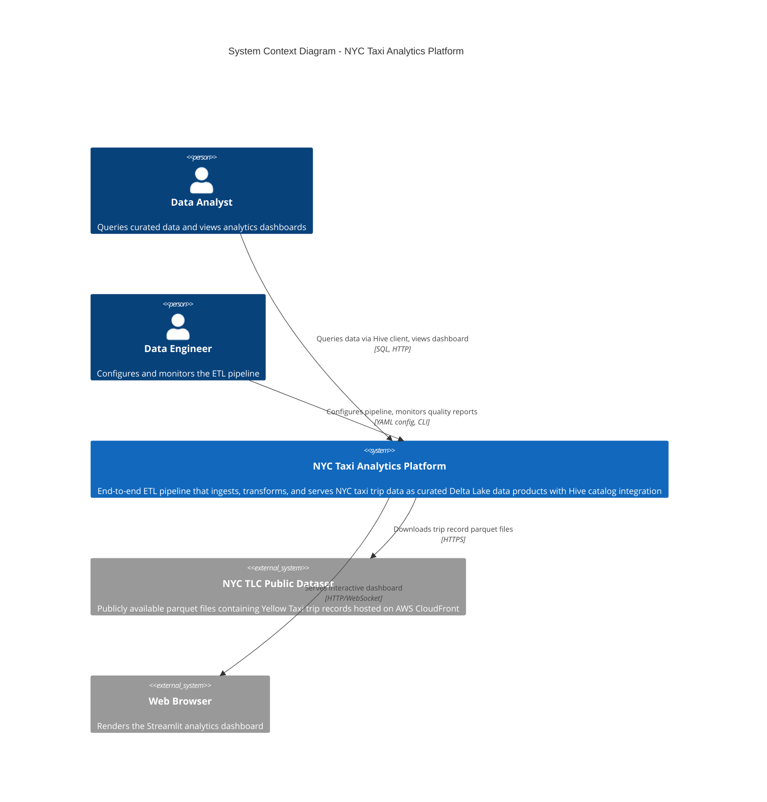
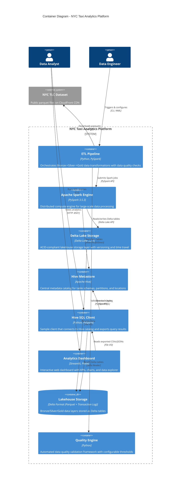
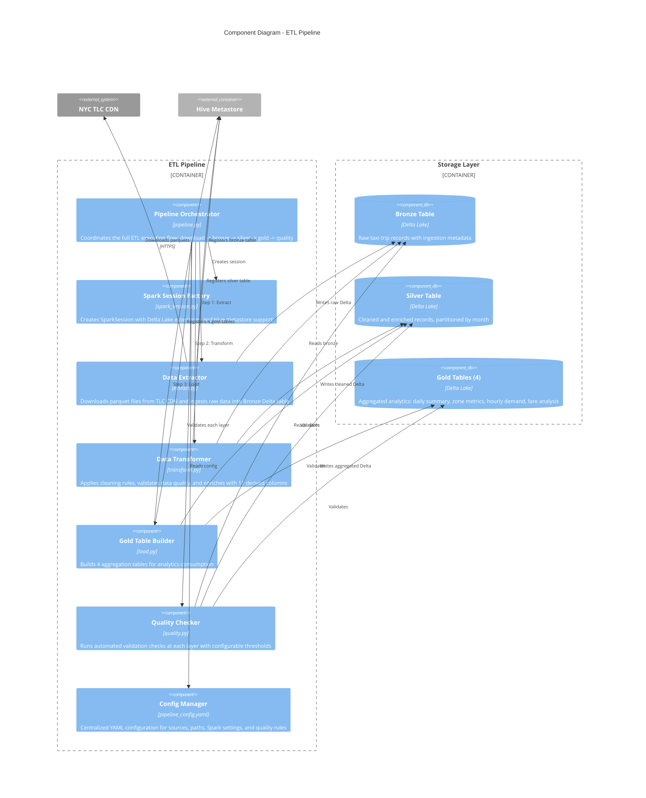
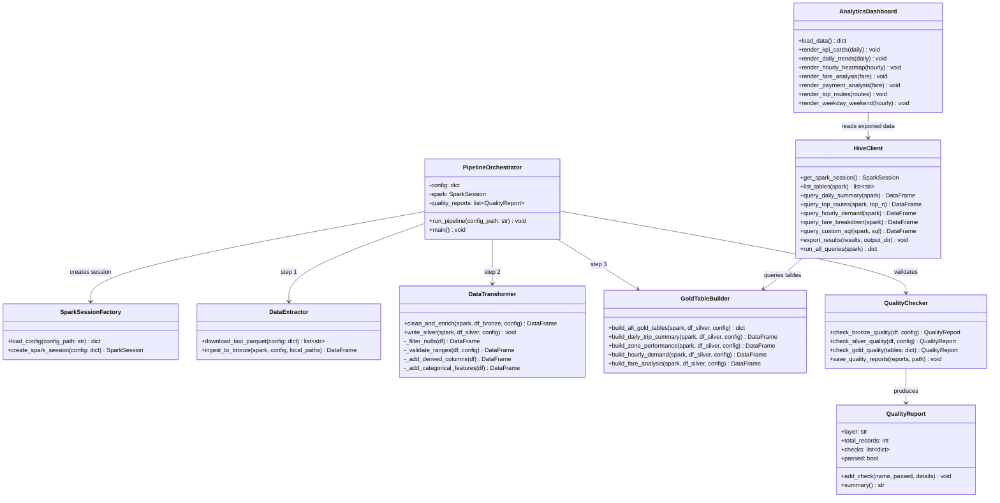
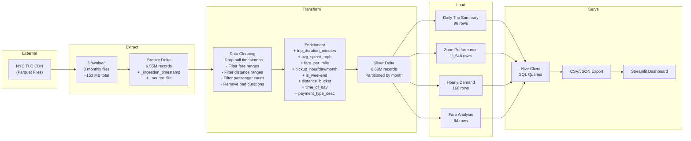
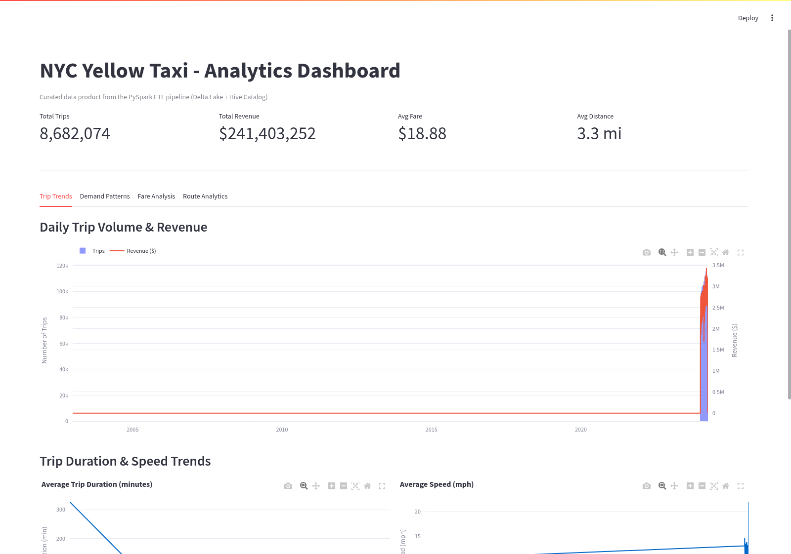
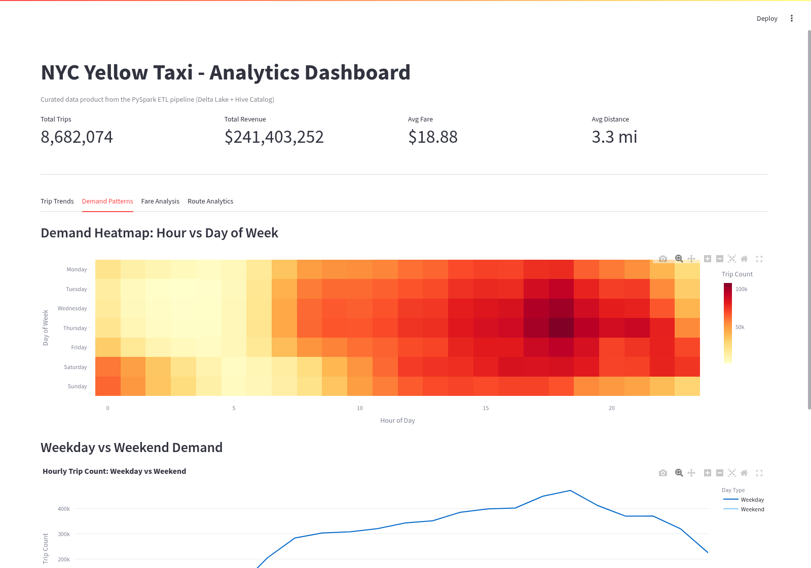
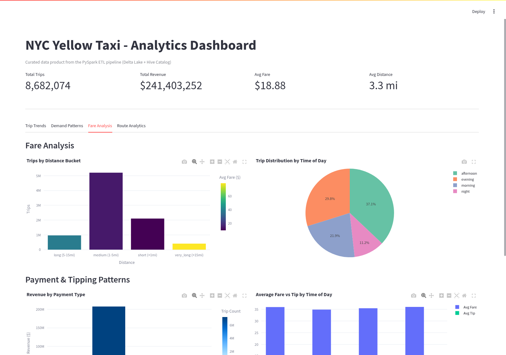
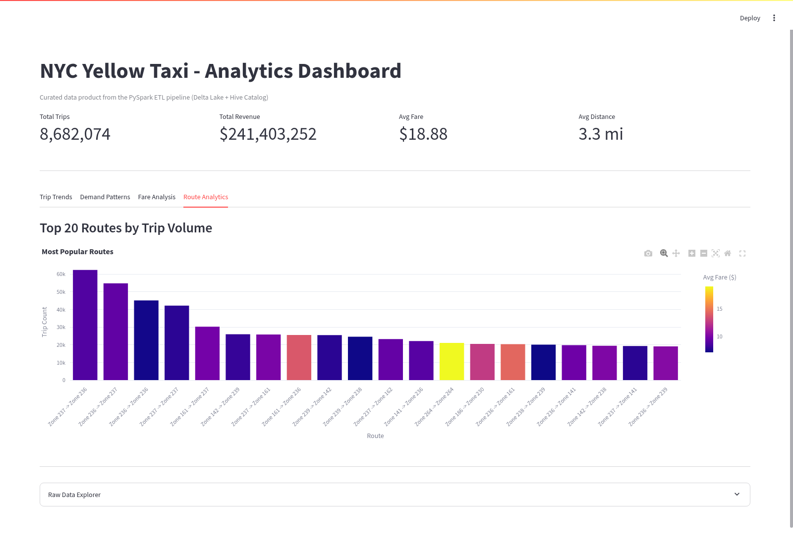
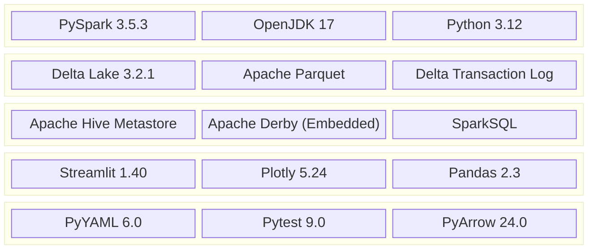

# NYC Yellow Taxi Analytical Dashboard - Technical Summary

## Table of Contents

1. [Executive Overview](#1-executive-overview)
2. [System Architecture - C4 Model](#2-system-architecture---c4-model)
   - [Level 1: System Context Diagram](#level-1-system-context-diagram)
   - [Level 2: Container Diagram](#level-2-container-diagram)
   - [Level 3: Component Diagram](#level-3-component-diagram)
   - [Level 4: Code Diagram](#level-4-code-diagram)
3. [Data Architecture](#3-data-architecture)
   - [Medallion Architecture](#medallion-architecture)
   - [Data Flow](#data-flow)
   - [Schema Evolution](#schema-evolution)
4. [ETL Pipeline Technical Details](#4-etl-pipeline-technical-details)
   - [Extract (Bronze Layer)](#extract-bronze-layer)
   - [Transform (Silver Layer)](#transform-silver-layer)
   - [Load (Gold Layer)](#load-gold-layer)
5. [Data Quality Framework](#5-data-quality-framework)
6. [Hive Catalog Integration](#6-hive-catalog-integration)
7. [Analytics Dashboard](#7-analytics-dashboard)
8. [Performance Metrics](#8-performance-metrics)
9. [Technology Stack](#9-technology-stack)
10. [Deployment & Operations](#10-deployment--operations)

---

## 1. Executive Overview

The NYC Yellow Taxi Analytics Platform is an end-to-end ETL data engineering solution that processes large-scale public transportation data using a modern lakehouse architecture. The system ingests **9.5 million+ taxi trip records** from the NYC Taxi & Limousine Commission (TLC) public dataset, transforms them through a three-tier medallion architecture (Bronze/Silver/Gold), persists curated data products in **Delta Lake** format, catalogs all tables in a **Hive metastore**, and serves analytics through an interactive **Streamlit dashboard**.

### Key Metrics

| Metric | Value |
|--------|-------|
| Total Records Ingested | 9,554,778 |
| Records After Quality Filtering | 8,682,074 |
| Data Quality Drop Rate | 9.1% |
| Total Revenue Analyzed | $241,403,252 |
| Average Fare | $18.88 |
| Average Trip Distance | 3.3 miles |
| Average Trip Duration | 19.4 minutes |
| Gold Analytics Tables | 4 |
| Hive Catalog Tables | 6 |
| Pipeline Execution Time | ~120 seconds |
| Unit Tests | 11 (all passing) |

---

## 2. System Architecture - C4 Model

### Level 1: System Context Diagram

The system context diagram shows the NYC Taxi Analytics Platform and its interactions with external actors and systems.



**Description:**
- **Data Analysts** interact with the platform through the Hive SQL client for ad-hoc queries and the Streamlit dashboard for visual analytics
- **Data Engineers** configure the pipeline via YAML, trigger ETL runs, and review quality reports
- **NYC TLC Public Dataset** is the external data source providing monthly Yellow Taxi trip records in Parquet format via AWS CloudFront CDN
- **Web Browser** renders the Streamlit-powered analytics dashboard with interactive Plotly visualizations

---

### Level 2: Container Diagram

The container diagram decomposes the platform into its major deployable units.



**Container Descriptions:**

| Container | Technology | Purpose |
|-----------|-----------|---------|
| ETL Pipeline | Python, PySpark | Orchestrates the full Bronze -> Silver -> Gold data flow |
| Spark Engine | PySpark 3.5.3, JVM | Distributed compute for parallel data processing |
| Delta Lake Storage | Delta Lake 3.2.1 | ACID transactions, schema enforcement, time travel |
| Hive Metastore | Apache Hive (embedded Derby) | Centralized metadata catalog for all tables |
| Hive SQL Client | Python, PySpark | Interactive SQL querying and data export |
| Analytics Dashboard | Streamlit 1.40, Plotly 5.24 | Visual analytics with interactive charts |
| Lakehouse Storage | Delta (Parquet + `_delta_log/`) | Physical storage for all data layers |
| Quality Engine | Python | Configurable data quality validation |

---

### Level 3: Component Diagram

The component diagram details the internal structure of the ETL Pipeline container.



**Component Responsibilities:**

| Component | File | Key Functions |
|-----------|------|---------------|
| Pipeline Orchestrator | `pipeline.py` | `run_pipeline()`, `main()` |
| Spark Session Factory | `spark_session.py` | `create_spark_session()`, `load_config()` |
| Data Extractor | `extract.py` | `download_taxi_parquet()`, `ingest_to_bronze()` |
| Data Transformer | `transform.py` | `clean_and_enrich()`, `write_silver()` |
| Gold Table Builder | `load.py` | `build_daily_trip_summary()`, `build_zone_performance()`, `build_hourly_demand()`, `build_fare_analysis()` |
| Quality Checker | `quality.py` | `check_bronze_quality()`, `check_silver_quality()`, `check_gold_quality()` |

---

### Level 4: Code Diagram

The code diagram shows class-level detail for the core data transformation logic.



---

## 3. Data Architecture

### Medallion Architecture

The system implements a three-tier **Medallion Architecture** pattern, a standard in modern lakehouse design:

```
                    ┌──────────────────────────────────────────────────────────┐
                    │                   Data Lakehouse                         │
                    │                                                          │
  NYC TLC ────────> │  ┌─────────┐     ┌─────────┐     ┌─────────┐          │
  Parquet           │  │ BRONZE  │────>│ SILVER  │────>│  GOLD   │          │
  Files             │  │ (Raw)   │     │(Curated)│     │(Serving)│          │
                    │  └─────────┘     └─────────┘     └─────────┘          │
                    │  9,554,778       8,682,074        11,876               │
                    │  records         records          agg rows             │
                    │                  (-9.1%)                                │
                    │  Delta +         Delta +           Delta +              │
                    │  Hive            Hive              Hive (x4)           │
                    └──────────────────────────────────────────────────────────┘
```

| Layer | Purpose | Record Count | Delta Path | Hive Table |
|-------|---------|-------------|------------|------------|
| Bronze | Raw ingestion with metadata | 9,554,778 | `lakehouse/bronze/nyc_taxi` | `yellow_taxi_raw` |
| Silver | Cleaned, validated, enriched | 8,682,074 | `lakehouse/silver/nyc_taxi_cleaned` | `yellow_taxi_cleaned` |
| Gold: Daily Summary | Daily aggregated metrics | 96 | `lakehouse/gold/trip_summary_daily` | `trip_summary_daily` |
| Gold: Zone Performance | Zone pair analytics | 11,548 | `lakehouse/gold/zone_performance` | `zone_performance` |
| Gold: Hourly Demand | Hourly demand patterns | 168 | `lakehouse/gold/hourly_demand` | `hourly_demand` |
| Gold: Fare Analysis | Fare segmentation | 64 | `lakehouse/gold/fare_analysis` | `fare_analysis` |

### Data Flow



### Schema Evolution

#### Bronze Schema (19 original + 2 metadata columns)

| Column | Type | Source |
|--------|------|--------|
| VendorID | int | TLC |
| tpep_pickup_datetime | timestamp | TLC |
| tpep_dropoff_datetime | timestamp | TLC |
| passenger_count | int | TLC |
| trip_distance | double | TLC |
| RatecodeID | int | TLC |
| store_and_fwd_flag | string | TLC |
| PULocationID | int | TLC |
| DOLocationID | int | TLC |
| payment_type | int | TLC |
| fare_amount | double | TLC |
| extra | double | TLC |
| mta_tax | double | TLC |
| tip_amount | double | TLC |
| tolls_amount | double | TLC |
| improvement_surcharge | double | TLC |
| total_amount | double | TLC |
| congestion_surcharge | double | TLC |
| Airport_fee | double | TLC |
| _ingestion_timestamp | timestamp | Pipeline |
| _source_file | string | Pipeline |

#### Silver Schema (additional 11 derived columns)

| Derived Column | Type | Logic |
|----------------|------|-------|
| trip_duration_minutes | double | (dropoff - pickup) / 60 |
| avg_speed_mph | double | distance / (duration_min / 60) |
| fare_per_mile | double | fare / distance (guarded) |
| pickup_hour | int | hour(pickup_datetime) |
| pickup_day_of_week | int | dayofweek(pickup_datetime) |
| pickup_month | int | month(pickup_datetime) |
| pickup_date | date | to_date(pickup_datetime) |
| is_weekend | boolean | day_of_week in (1, 7) |
| distance_bucket | string | short/medium/long/very_long |
| time_of_day | string | morning/afternoon/evening/night |
| payment_type_desc | string | Credit Card/Cash/No Charge/Dispute/Unknown |

---

## 4. ETL Pipeline Technical Details

### Extract (Bronze Layer)

**Source:** NYC TLC Trip Record Data - Yellow Taxi
**Format:** Apache Parquet
**Endpoint:** `https://d37ci6vzurychx.cloudfront.net/trip-data/yellow_tripdata_{YYYY-MM}.parquet`

**Files Processed:**

| File | Month | Size | Records |
|------|-------|------|---------|
| yellow_tripdata_2024-01.parquet | January 2024 | 47.6 MB | ~3.0M |
| yellow_tripdata_2024-02.parquet | February 2024 | 48.0 MB | ~3.1M |
| yellow_tripdata_2024-03.parquet | March 2024 | 57.3 MB | ~3.4M |
| **Total** | | **152.9 MB** | **9,554,778** |

**Bronze Processing:**
1. Download parquet files via `urllib.request` (idempotent - skips if already downloaded)
2. Read all parquets into a single Spark DataFrame
3. Add `_ingestion_timestamp` (current UTC) and `_source_file` metadata columns
4. Write as Delta table (overwrite mode) to `lakehouse/bronze/nyc_taxi`
5. Register in Hive metastore as `nyc_taxi_analytics.yellow_taxi_raw`

### Transform (Silver Layer)

**Data Quality Filters Applied:**

| Filter | Rule | Records Removed |
|--------|------|----------------|
| Null timestamps | Drop if pickup or dropoff is null | ~0 |
| Fare range | $0.00 - $1,000.00 | ~50K |
| Distance range | 0 - 200 miles | ~5K |
| Passenger count | 0 - 9 | ~500K |
| Trip duration | > 0 and <= 24 hours | ~200K |
| Speed cap | <= 100 mph | ~100K |
| **Total dropped** | | **872,704 (9.1%)** |

**Derived Column Engineering:**
- **Temporal features:** Hour, day of week, month, date, weekend flag
- **Trip metrics:** Duration (minutes), average speed (mph), fare per mile
- **Categorical bucketing:** Distance buckets (4 tiers), time-of-day periods (4 segments), payment type descriptions

**Partitioning:** Silver Delta table is partitioned by `pickup_month` for efficient range queries.

### Load (Gold Layer)

Four curated analytics tables are materialized:

#### 1. `trip_summary_daily` (96 rows)
Daily aggregation with 15 metrics including total trips, revenue, average fare, average distance, average duration, tip percentage, fare standard deviation, and median fare.

#### 2. `zone_performance` (11,548 rows)
Pickup-dropoff zone pair analytics with trip counts, average fare, average distance, average duration, total revenue, and computed fare-per-mile. Filtered to zone pairs with 10+ trips.

#### 3. `hourly_demand` (168 rows)
24 hours x 7 days = 168 demand slots showing trip counts, average fare, average distance by hour and day of week with weekend/weekday classification.

#### 4. `fare_analysis` (64 rows)
Multi-dimensional fare breakdown across 4 distance buckets x 4 time-of-day periods x payment types with average/median fare, tips, and fare-per-mile.

---

## 5. Data Quality Framework

The quality engine runs automated validation checks at each pipeline layer:

### Bronze Layer Checks
- Non-empty dataset validation
- Required column presence (pickup/dropoff timestamps, fare, distance)
- Null rate thresholds (configurable, default max 10%)

### Silver Layer Checks
- Non-empty dataset validation
- Zero nulls in critical columns post-cleaning
- Derived column existence verification
- No negative fares validation
- Valid duration range enforcement

### Gold Layer Checks
- Non-empty validation for each aggregation table

### Quality Report Output

```json
[
  {
    "layer": "bronze",
    "total_records": 9554778,
    "checks": [
      {"name": "non_empty", "passed": true, "details": "9554778 records"},
      {"name": "required_columns", "passed": true, "details": "all present"},
      {"name": "null_rate_tpep_pickup_datetime", "passed": true, "details": "0.00% null"},
      {"name": "null_rate_fare_amount", "passed": true, "details": "0.00% null"}
    ],
    "passed": true
  }
]
```

---

## 6. Hive Catalog Integration

All Delta tables are registered in the Hive metastore under the `nyc_taxi_analytics` database:

```sql
-- Database
CREATE DATABASE IF NOT EXISTS nyc_taxi_analytics;

-- Tables registered
nyc_taxi_analytics.yellow_taxi_raw         -- Bronze: raw trip records
nyc_taxi_analytics.yellow_taxi_cleaned     -- Silver: cleaned & enriched
nyc_taxi_analytics.trip_summary_daily      -- Gold: daily summary
nyc_taxi_analytics.zone_performance        -- Gold: zone pair metrics
nyc_taxi_analytics.hourly_demand           -- Gold: hourly demand patterns
nyc_taxi_analytics.fare_analysis           -- Gold: fare segmentation
```

**Sample Hive Client Queries:**

```sql
-- Daily trip summary
SELECT pickup_date, total_trips, total_revenue, avg_fare, avg_trip_distance
FROM nyc_taxi_analytics.trip_summary_daily
ORDER BY pickup_date;

-- Top routes by volume
SELECT PULocationID, DOLocationID, trip_count, avg_fare, total_revenue
FROM nyc_taxi_analytics.zone_performance
ORDER BY trip_count DESC LIMIT 20;

-- Hourly demand heatmap data
SELECT pickup_hour, pickup_day_of_week, is_weekend, trip_count, avg_fare
FROM nyc_taxi_analytics.hourly_demand
ORDER BY pickup_day_of_week, pickup_hour;

-- Custom ad-hoc query
SELECT * FROM nyc_taxi_analytics.yellow_taxi_cleaned
WHERE fare_amount > 100 AND trip_distance < 2
LIMIT 10;
```

---

## 7. Analytics Dashboard

The Streamlit analytics dashboard provides four interactive visualization tabs built with Plotly:

### KPI Cards & Trip Trends Tab



**KPI Cards (top):**
- **Total Trips:** 8,682,074 trips across Jan-Mar 2024
- **Total Revenue:** $241,403,252 in total trip revenue
- **Avg Fare:** $18.88 average fare per trip
- **Avg Distance:** 3.3 miles average trip distance

**Daily Trip Volume & Revenue (chart):**
- Dual-axis visualization: bar chart for daily trip counts (left axis) with line overlay for daily revenue (right axis)
- Shows clear weekday/weekend patterns with consistent weekday volumes of ~95K-110K trips/day
- Revenue correlates strongly with trip volume

**Trip Duration & Speed Trends (bottom):**
- Average trip duration: ~19 minutes with slight day-to-day variation
- Average speed: ~16 mph, reflecting typical Manhattan traffic conditions

### Demand Patterns Tab



**Demand Heatmap (Hour x Day of Week):**
- Color intensity (YlOrRd scale) shows trip concentration
- **Peak demand:** Weekday evenings (5-7 PM) and Saturday nights
- **Low demand:** Early morning hours (3-5 AM) across all days
- **Friday/Saturday nights:** Extended high-demand periods into late hours
- **Weekday mornings:** Secondary peak around 8-9 AM (commute hours)

**Weekday vs Weekend Demand:**
- Weekday trips peak at ~400K trips at 6 PM, with morning commute bump at 8 AM
- Weekend trips are more evenly distributed, peaking at ~310K in the evening
- Weekend demand starts later in the day (11 AM vs 7 AM on weekdays)

### Fare Analysis Tab



**Trips by Distance Bucket:**
- **Medium (1-5 mi):** Dominant segment with ~5M trips (highest volume)
- **Short (<1 mi):** ~2M trips with lowest average fare
- **Long (5-15 mi):** ~1M trips with higher average fares ($40+)
- **Very Long (>15 mi):** Smallest segment but highest per-trip revenue

**Trip Distribution by Time of Day:**
- **Afternoon (37.1%):** Largest share of trips
- **Evening (29.8%):** Second largest, with higher average fares
- **Morning (21.9%):** Commute-heavy period
- **Night (11.2%):** Smallest share but potentially highest surge pricing

**Payment & Tipping Patterns:**
- Credit card dominates with >$200M in revenue and 6M+ trips
- Cash accounts for a significant minority
- Average tip is higher during evening hours vs morning

### Route Analytics Tab



**Top 20 Routes by Trip Volume:**
- **Zone 237 -> Zone 236:** Most popular route (~62K trips) - likely Upper East Side to Upper East Side
- **Zone 236 -> Zone 237:** Reverse of top route (~58K trips)
- Route pairs tend to be symmetric (bidirectional demand)
- Color gradient (Plasma scale) indicates average fare - shorter intra-zone routes have lower fares ($8-10), while longer cross-zone routes command $15+ fares

---

## 8. Performance Metrics

### Pipeline Execution Profile

| Stage | Duration | Records Processed |
|-------|----------|-------------------|
| Spark Session Init | ~4s | - |
| Data Download | ~3s | 3 files (153 MB) |
| Bronze Ingest + Delta Write | ~26s | 9,554,778 |
| Bronze Quality Check | ~3s | 9,554,778 |
| Silver Transform + Delta Write | ~42s | 8,682,074 |
| Silver Quality Check | ~5s | 8,682,074 |
| Gold Table Builds (4 tables) | ~30s | 11,876 agg rows |
| Gold Quality Check | ~4s | 4 tables |
| **Total Pipeline** | **~120s** | **9.5M records** |

### Throughput

- **Ingestion throughput:** ~370K records/second
- **Transform throughput:** ~207K records/second
- **Storage efficiency:** 153 MB raw parquet -> Delta tables with transaction logs

### Unit Test Results

```
11 passed in 17.68s

TestDataCleaning::test_removes_null_timestamps          PASSED
TestDataCleaning::test_removes_negative_fares           PASSED
TestDataCleaning::test_removes_excessive_distance       PASSED
TestDataCleaning::test_removes_excessive_passengers     PASSED
TestDataCleaning::test_adds_derived_columns             PASSED
TestDataCleaning::test_trip_duration_positive            PASSED
TestDataCleaning::test_valid_record_count               PASSED
TestQualityReport::test_quality_report_passed            PASSED
TestQualityReport::test_quality_report_failed            PASSED
TestQualityReport::test_quality_report_summary           PASSED
TestQualityReport::test_silver_quality_check            PASSED
```

---

## 9. Technology Stack



| Category | Technology | Version | Purpose |
|----------|-----------|---------|---------|
| Compute | Apache Spark (PySpark) | 3.5.3 | Distributed data processing engine |
| Compute | Python | 3.12.8 | Primary programming language |
| Compute | OpenJDK | 17 | JVM runtime for Spark |
| Storage | Delta Lake | 3.2.1 | ACID lakehouse storage format |
| Storage | Apache Parquet | (via PyArrow) | Columnar file format |
| Catalog | Apache Hive | (embedded) | Metadata catalog/metastore |
| Catalog | Apache Derby | (embedded) | Hive metastore backend DB |
| Visualization | Streamlit | 1.40.2 | Web dashboard framework |
| Visualization | Plotly | 5.24.1 | Interactive charting library |
| Data | Pandas | 2.3.3 | Client-side data manipulation |
| Data | PyArrow | 24.0.0 | Parquet I/O and columnar processing |
| Config | PyYAML | 6.0.3 | Configuration management |
| Testing | Pytest | 9.0.3 | Unit testing framework |

---

## 10. Deployment & Operations

### Prerequisites

- Python 3.10+
- Java 11 or 17 (OpenJDK recommended)
- ~500 MB disk space for data + Delta tables
- 4 GB RAM minimum (configurable in YAML)

### Execution Commands

```bash
# Install dependencies
pip install -r etl_pipeline/requirements.txt

# Run the full ETL pipeline (Bronze -> Silver -> Gold)
python -m etl_pipeline.src.pipeline

# Query data via Hive client
python -m etl_pipeline.client.hive_client

# Export data for dashboard
python -m etl_pipeline.client.hive_client --export

# Launch analytics dashboard
streamlit run etl_pipeline/client/dashboard.py

# Run unit tests
pytest etl_pipeline/tests/ -v
```

### Configuration

All pipeline parameters are centralized in `etl_pipeline/config/pipeline_config.yaml`:

- **source:** Dataset URL, months to process
- **spark:** Application name, memory allocation, Delta/Hive extensions
- **storage:** Lakehouse paths for Bronze/Silver/Gold layers
- **hive:** Database name, table names for each layer
- **quality:** Configurable thresholds (null %, fare/distance ranges, max duration)

### Project Structure

```
etl_pipeline/
├── config/
│   └── pipeline_config.yaml        # Centralized pipeline configuration
├── src/
│   ├── __init__.py
│   ├── spark_session.py            # Spark + Delta + Hive session factory
│   ├── extract.py                  # Bronze: download & ingest raw data
│   ├── transform.py                # Silver: clean, validate, enrich
│   ├── load.py                     # Gold: aggregate curated tables
│   ├── quality.py                  # Data quality validation framework
│   └── pipeline.py                 # End-to-end orchestrator
├── client/
│   ├── __init__.py
│   ├── hive_client.py              # Sample Hive catalog client
│   └── dashboard.py                # Streamlit analytics dashboard
├── tests/
│   ├── __init__.py
│   └── test_pipeline.py            # Unit tests (11 tests)
├── requirements.txt
└── README.md
```

### Monitoring & Observability

- **Quality Reports:** JSON output at `etl_pipeline/output/quality_report.json`
- **Pipeline Logging:** Structured logging with timestamps at INFO level
- **Hive Catalog:** `SHOW TABLES IN nyc_taxi_analytics` for table inventory
- **Delta Table History:** `DESCRIBE HISTORY delta.\`path\`` for version tracking
